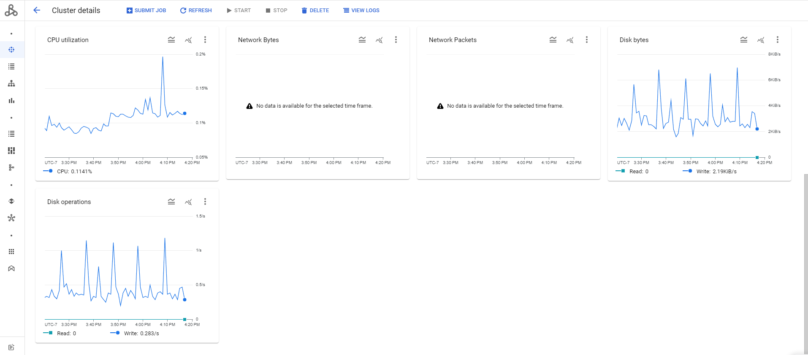
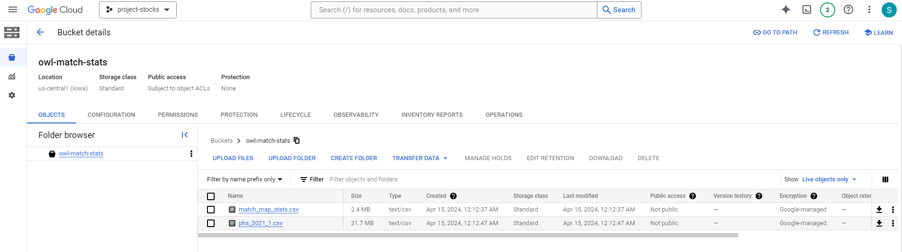
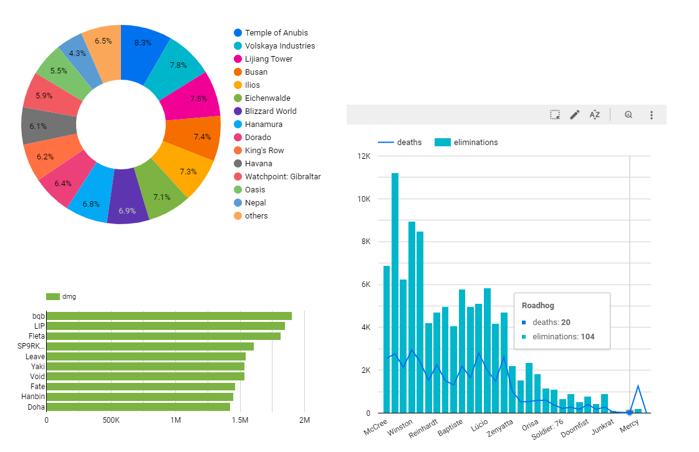

# Overwatch League Stats

## Background

Overwatch is a first-person shooter team game with with a wide variety of heroes to choose from. [Overwatch League (OWL)](https://overwatchleague.com/en-us/news/23303225) was the professional esports league of Overwatch. I really enjoyed watching the OWL games since start, and have compiled and uploaded the game match stats to my [Kaggle](https://www.kaggle.com/datasets/sherrytp/overwatch-league-stats-lab). After initially struggling with analyzing vast amounts of stock data, I eventually shifted focus to illustrating the data engineering process using smaller datasets. This approach effectively showcases the orchestration of diverse data sources.

The datasets, originally provided by IBM Watson, include players, head-to-head match-ups, and maps. The player historical statistics should contain OWL games from 2018 till now. It's centered around each player, and player's picked hero, its team name, performance, match IDs, etc.

## Table of Contents

- [Background]()
- [Problem Statement]()
- [Data Architecture]()
- [Getting Started]()
- [Prerequisites]()
- [Steps]
- [Dashboard]()
- [Future Work]()
- [Acknowledgements]()

## Problem Statement

## Data Architecture

The project is designed with a stream data pipeline and expected to batch processing the OWL match data weekly. A few technologies used:

- **Cloud**: Google Cloud Platform (GCP)
    - **Data Lake**: [Google Cloud Storage](https://cloud.google.com/storage)
    - **Data Warehourse**: [Google BigQuery](https://cloud.google.com/bigquery)
-  **Infrastructure as Code**: [Terraform](https://www.terraform.io/downloads/)
- **Workflow Orchestration**: 
    - [Mage](https://github.com/mage-ai/mage-zoomcamp?tab=readme-ov-file#lets-get-started)
    - [Airflow](https://airflow.apache.org)
- **Data Ingestiong**:  Batch Processin with [Spark](https://spark.apache.org/) on [Dataproc](https://cloud.google.com/dataproc)
- **Transformation**: 
    - Spark
    - [dbt](https://github.com/dbt-labs/dbt-core/blob/main/docker/Dockerfile)
- **Visualisation**: [Google Data Studio](https://datastudio.google.com/)

## Getting Started 

### Prerequisites

I created this project in WSL 2 (Windows Subsystem for Linux) on Windows 10. 
To get a local copy up and running in the same environment, you'll need to:

- Install [WSL 2](https://docs.microsoft.com/en-us/windows/wsl/install) (Windows Subsystem for Linux) on Windows
- [Install Docker Desktop](https://docs.docker.com/desktop/windows/install/)
- Install Python (py3.10 above used for the project)
- Install VSCode
- Have a Google Cloud Platform account
- [Install Google Cloud SDK](https://cloud.google.com/sdk/docs/install-sdk#deb) for Ubuntu

### Create a Google Cloud Project

1. Go to [Google Cloud](https://console.cloud.google.com/) and create a new project. The default project id is `project-stocks`. 
2. Go to IAM and [create a Service Account](https://cloud.google.com/docs/authentication/getting-started#creating_a_service_account) with these roles:
    - BigQuery Admin
    - Compute Admin
    - Storage Admin
    - Storage Object Admin
    - Viewer
3. Download the Service Account credentials and put inside the `terraform` folder.
4. On the Google console, enable the following APIs:
    - IAM API
    - IAM Service Account Credentials API
    - Cloud Dataproc API
    - Compute Engine API
    - Lookder Studio

### Set up the infrastructure with Terraform on Google Cloud Platform

1. Open the project folder in VSCode with WSL
2. Open `variables.tf` and modify:
    * `variable "project"` to your own project id, maybe not neccessary
    * `variable "region"` to your project region
    * `variable "credentials"` to your credentials path
3. Open the terminal in VSCode and change directory to terraform folder: `cd terraform` 
4. Initialize Terraform: `terraform init`
5. Plan the infrastructure: `terraform plan`
6. Apply the changes: `terraform apply`
7. Refer to the details [notes]('/terraform/README.md') if you are not fully familiar with terraform setup. 

If everything goes right, you now have a bucket on Google Cloud Storage called '<your_project>' and a dataset on BigQuery called ''.

### Port Mage to Run the Scheduled Pipeline

1. I already clone the Mage-zoomcamp folder to the repo, so go to the [`mage-zoomcamp`]('/mage-zoomcamp/') folder: `cd mage-zoomcamp`
2. Change name of the `dev.env` file to `.env` to set up the environment
3. Change the `GOOGLE_PROJECT_ID` and other project_ID and database buckets to your setup
4. Run `docker-compose build`
5. Run `docker-compose up` and agree to the updates
6. Go to port `http://localhost:6789/` and run the scheduled mage pipeline `owl_pipeline`. 
7. Close out mage and the port after `match_stats` and `map_stats` datasets are successfully uploaded to GCS and BigQuery. Run `docker-compose down` to end. 

### Airflow Optional

Use the dockerized files `docker-compose up` to set up Airflow Orchestration to replace Mage. #WIP

### dbt Optional

Refer to the [instructions]('/dbt_docker/README.md') to set up dbt with BigQuery on Docker. The transformation can also be done within Mage or Spark. I include the PydSpark transformation scripts below. 

### Spark ETL Jobs

Follow along the [Spark]('/spark/README.md') notes if you are not fully sure about running PySpark on the Google Cloud Storage. You need to configure a few environment variables before successfully running. 

1. Follow the script `spark_sql.py` to oad the data stored in GCS bucket and BigQuery into a PySpark dataframe. 
2. Transform and clean the data using PySpark functions and write it to BigQuery. 
3. Create a DataProc cluster named `owl-analysis-cluster` with the same location to GCS region, and use the `spark_local.py` script to submit jobs. 

### Dashboard 

Looker Studio is a cloud-based business intelligence and data analytics platform used for visualizing the useful insights.

Link to the dashboard with Analytics: https://lookerstudio.google.com/reporting/ac7d4497-216a-4924-8755-68d058dd129e

1. Pie chart of maps being played thruought the season - distribution of categorical data
2. Total damage by player, sorting by the most
3. Total elimination vesus death per game by hero - distribution of data across a temporal line

## Roadmap for Future Development

- [ ] More unit tests on Mage
- [ ] Automation tests
- [ ] CI/CD
- [ ] Machine Learning predictions on game matches

## Contributing

Feel free to comment or contribute to this project or my dataset on Kaggle. 

Much appreciation to [Data Engineering Zoomcamp by DataTalksClub](https://github.com/DataTalksClub/data-engineering-zoomcamp) for the amazing course. 